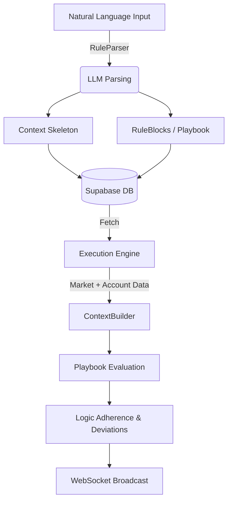

# General Architecture

The Rule Engine operates as a pipeline: it parses natural language into a structured playbook, compiles it to the database, and executes it in real-time against a stream of market and account data.

## The Pipeline

## Core Systems
1. **LLM Layer (`llm_layer/`)**: Translates messy user inputs into deterministic rule sets and required context variables.
2. **Execution Engine (`execution_engine.py`)**: Runs the real-time WebSocket loop, listening for market data and orchestrating evaluation.
3. **Core Engine (`engine.py`)**: The building blocks of the playbook (`Primitive`, `Extension`, `RuleBlock`, `ContextBuilder`).
4. **Adherence Engine (`logic_adherence.py`)**: Analyzes evaluated rules to determine if the trader broke discipline.
